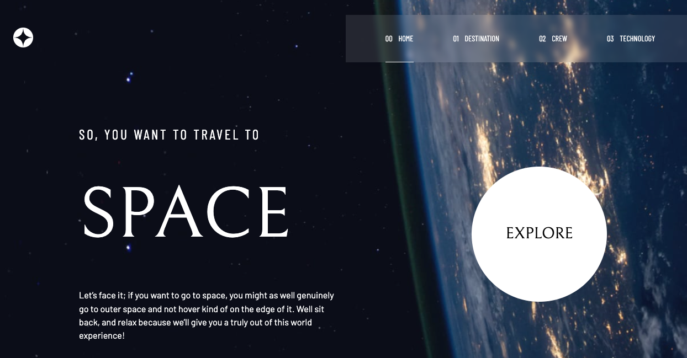

# Frontend Mentor - Space tourism website solution

This is a solution to the [Space tourism website challenge on Frontend Mentor](https://www.frontendmentor.io/challenges/space-tourism-multipage-website-gRWj1URZ3). Frontend Mentor challenges help you improve your coding skills by building realistic projects. 

## Table of contents

- [Overview](#overview)
  - [The challenge](#the-challenge)
  - [Screenshot](#screenshot)
  - [Links](#links)
- [My process](#my-process)
  - [Built with](#built-with)
  - [Continued development](#continued-development)
- [Author](#author)

## Overview

### The challenge

Users should be able to:

- View the optimal layout for each of the website's pages depending on their device's screen size
- See hover states for all interactive elements on the page
- View each page and be able to toggle between the tabs to see new information

### Screenshot

### Links

- Solution URL: [GitHub](https://github.com/untalinfo/space-tourism-react)

## My process

### Built with

- Semantic HTML5 markup
- CSS custom properties
- Flexbox
- CSS Grid
- Sass
- Mobile-first workflow
- [React](https://reactjs.org/) - JS library

### Continued development

I will continue adding more transitions and animations that are more fluid and consistent with the style of the page.

## Author

- Website - [Oscar Info](https://github.com/untalinfo)
- Frontend Mentor - [@untalinfo](https://www.frontendmentor.io/profile/untalinfo)
- Twitter - [@untalinfo](https://www.twitter.com/untalinfo)

